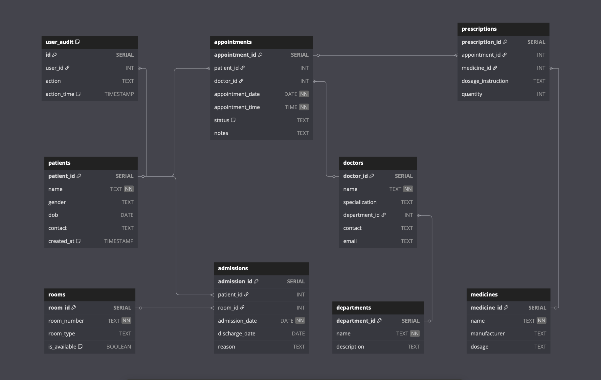

# 🏥 Hospital Analytics Management System (SQL Capstone Project)

## 📌 Project Overview

This is a PostgreSQL-based Hospital Management System built as a **capstone project** in Week 22 of my training at Brototype.  
The project demonstrates **advanced SQL concepts** through a real-world healthcare data model, including analytics, automation, and optimization.

---

## 🚀 Features

- ✅ Relational schema for patients, doctors, appointments, admissions, prescriptions
- ✅ Data normalization (1NF to 3NF) and ER diagram (not included here)
- ✅ Stored procedures and user-defined functions (PL/pgSQL)
- ✅ Triggers for logging and workflow automation
- ✅ Advanced SQL: Joins, subqueries, window functions, CASE, CTEs
- ✅ Performance tuning using indexes and `EXPLAIN ANALYZE`
- ✅ Organized folder structure for GitHub showcase

---

## 🧱 Project Structure

hospital-sql-project/
├── README.md                      # This file
├── schema/                        # All database structure & data
│   ├── create_tables.sql          # CREATE TABLE statements
│   ├── insert_data.sql            # Sample INSERTs
├── queries/                       # Core queries and logic
│   ├── analytics_queries.sql      # JOINs, window functions, etc.
│   ├── triggers_and_functions.sql # Triggers, procedures, functions
│   └── optimization_notes.sql     # Indexing and EXPLAIN ANALYZE results
├── explain_outputs/               # Output of query performance analysis
│   └── query_analysis.txt
└── extras/
└── python_integration.ipynb  # Optional: Python connection using psycopg2 or pandas

---

## 🧠 Concepts Covered

- PostgreSQL (advanced SQL)
- Relational database design & normalization (1NF, 2NF, 3NF)
- Foreign keys and constraints
- Stored procedures and functions (PL/pgSQL)
- Triggers (AFTER INSERT/UPDATE)
- Aggregate functions and GROUP BY
- Window functions (`ROW_NUMBER()`, `RANK()`, `LAG()` etc.)
- Views and Common Table Expressions (CTEs)
- Indexing & Query optimization

---

## 🛠️ Tech Stack

- **PostgreSQL** — Relational database system
- **SQL / PLpgSQL** — Query language + scripting
- **Git & GitHub** — Version control & showcase
- *(Optional)*: Python with `pandas` or `psycopg2` for data access

---

## 👨‍💻 Author

- **Nivin Benny**
- Aspiring Data Scientist @ Brototype
- 📫 [LinkedIn](https://www.linkedin.com/in/nivinbenny) *(Add your real link)*

---

## 📢 How to Use

1. **Clone the repository:**

git clone https://github.com/your-username/hospital-sql-project.git
cd hospital-sql-project

2. **Create and connect to PostgreSQL database:**

createdb hospital_db
psql -U postgres -d hospital_db -f schema/create_tables.sql
psql -U postgres -d hospital_db -f schema/insert_data.sql

3.	**Run analytics and other queries:**

psql -U postgres -d hospital_db -f queries/analytics_queries.sql
psql -U postgres -d hospital_db -f queries/triggers_and_functions.sql

4.	**(Optional): Explore the Python integration notebook inside /extras**

---

## 🖼️ ER Diagram

